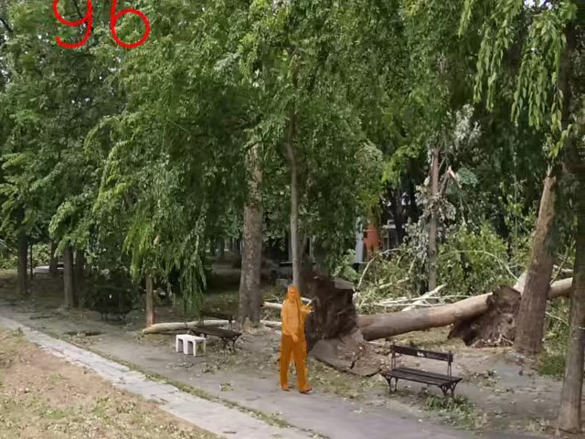
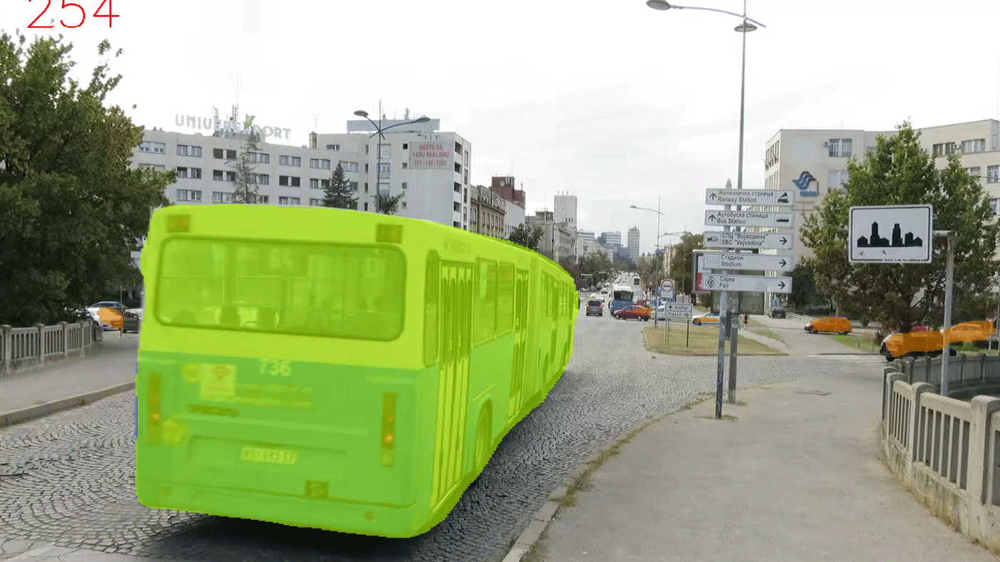
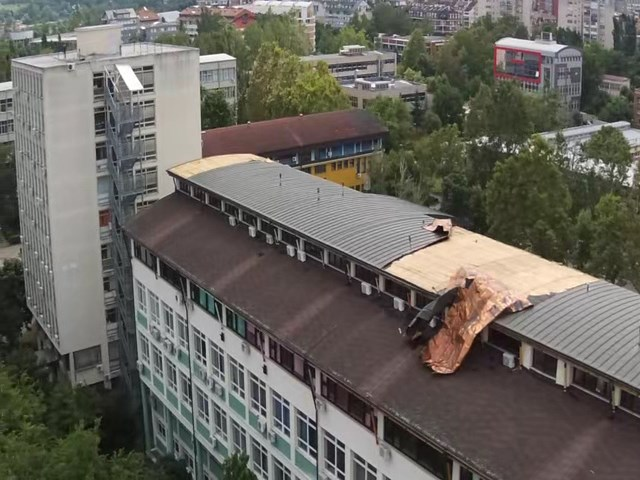
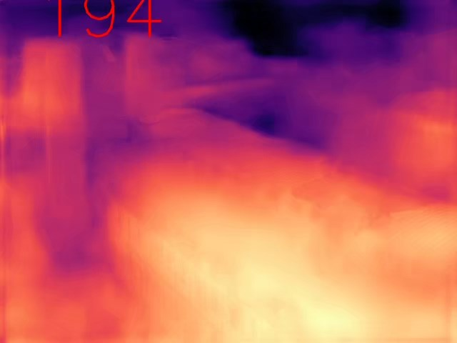
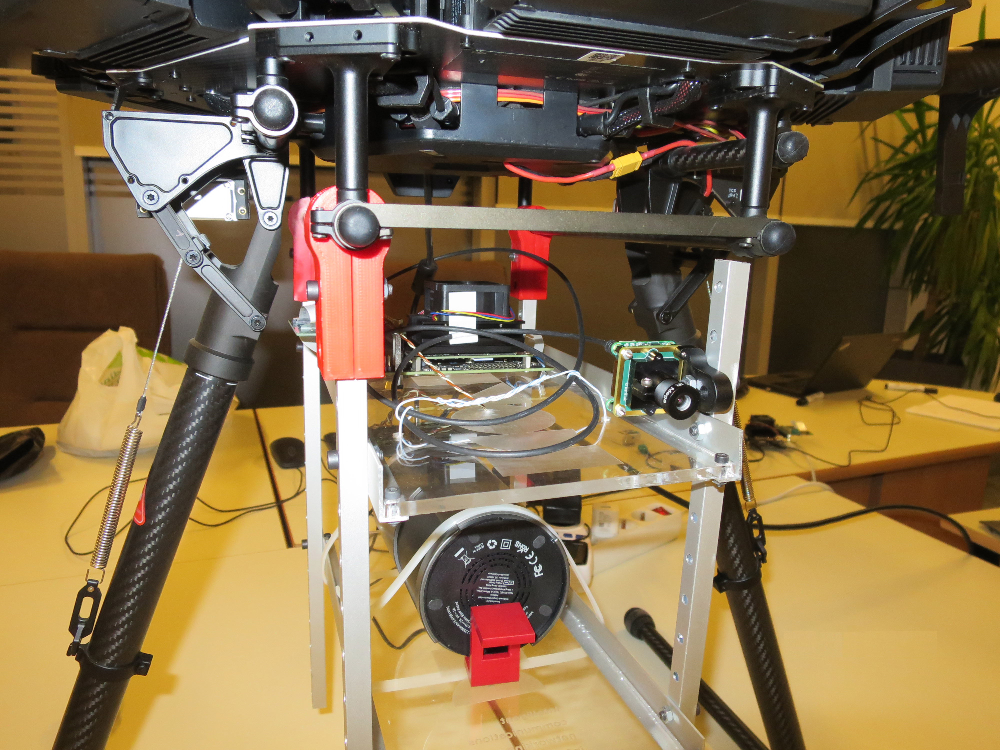
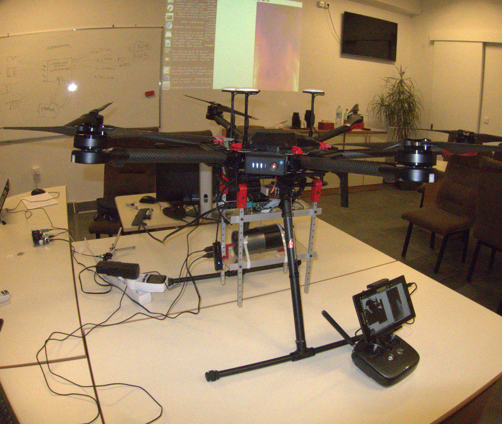

# **ViTech**
## **Computer Vision Gateway for real-time stream processing**
### Gstreamer, OpenCV, TensorRT, H.265
#### Tested on Jetson Nano

___
* Stream processing and AI deployment with low power consumption and low memory footprint

* Hardware encoding and decoding for any combination of user defined input and output image/video streams

* Versatile tool for performing both low-level and high-level vision tasks

* Jetson implementation utilizing heterogeneous computing environment, suitable for outdoor application scenarios

* Support for model translators and compilers enabling creation of optimized AI inference engines

* Test examples: semantic segmentation, image classification, real-time monocular depth estimation on drone platform

 

 

___

 

## **Functional blocks:**

 

 

___

 

## **Examples**

 

### **Semantic segmentation:**

 

[--->>> testVideoOut1_pedestrian](./readmeFiles/testVideoOut1_pedestrian.mp4 "testVideoOut1_pedestrian")

 

[--->>> testVideoOut2_traffic](./readmeFiles/testVideoOut2_traffic.mp4 "testVideoOut2_traffic")

___

 

### **Monocular depth estimation:**

 

[--->>> testVideoOut3_unprocessed](./readmeFiles/testVideoOut3_depth_1-1.mp4 "testVideoOut3_depth_1-1")

[--->>> testVideoOut3_depth](./readmeFiles/testVideoOut3_depth_1-2.mp4 "testVideoOut3_depth_1-2")
___

 

### **UAV integration:**

 

 

____

